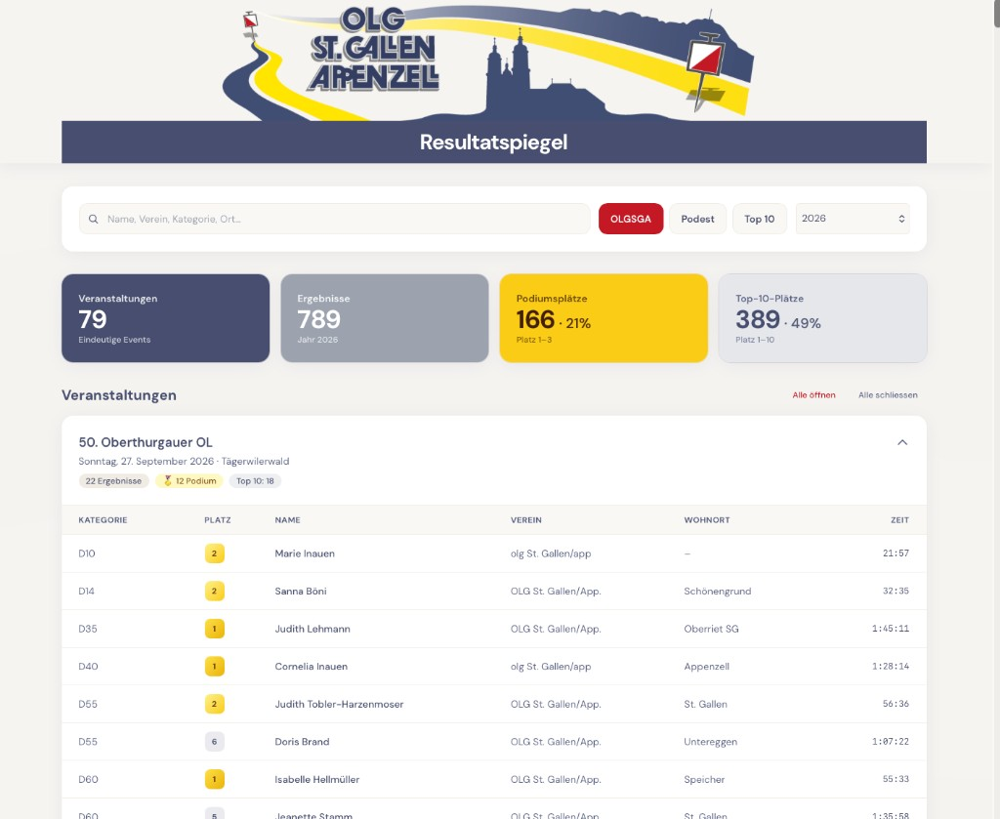

# solv-scraper

Python scraper for Swiss orienteering (SOLV) results from [o-l.ch](https://o-l.ch/cgi-bin/results). Downloads per-event CSV files, merges them into a unified dataset, and extracts top-10 results for OLG St.Gallen/Appenzell (OLGSGA).

A static **Resultatspiegel** dashboard (`index.html`) lets club members browse merged results in the browser (year filter, search, OLGSGA / top-10 filters).

## Overview



The dashboard reads merged CSVs from `aggregated-data/` (year selector, OLGSGA / podium / top-10 filters, searchable event list).

## Setup

```bash
pip install -e ".[dev]"
```

## Usage

Run the full pipeline (download + merge + filter + Affinity export):

```bash
python -m solv_scraper --year 2026
```

This downloads all events for **2026 and 2025** that are not yet in `downloaded-data/`, then writes:

| Output | Description |
|--------|-------------|
| `downloaded-data/YYYY-MM-DD-event-name.csv` | Raw result CSV per event |
| `downloaded-data/*.meta.json` | Event metadata (id, name, location) |
| `aggregated-data/master-<year>.csv` | All results for that year in a flat schema |
| `aggregated-data/master-top-ten.csv` | Ranks 1–10 for OLGSGA club (all years) |
| `aggregated-data/master-affinity.txt` | OLGSGA top-10 from the last 4 months, grouped by event for Affinity copy-paste |

### Options

- `--skip-download` — rebuild master files from existing downloads only
- `--skip-location-fetch` — skip fixture lookups during download (faster)
- `--root PATH` — repository root (auto-detected by default)

## GitHub Actions

The workflow in `.github/workflows/scrape.yml` runs on Sunday, Monday, Thursday, and Saturday at 06:00 UTC, and can be triggered manually with an optional year. It commits new downloads and updated master files to the repository.

## Data formats

The scraper detects four CSV layouts from o-l.ch:

| Format | Detection | Team handling |
|--------|-----------|---------------|
| **Standard** | Header contains `Jahrgang` | Single runner per row |
| **Team** | Header contains `Name2`, `Jg` | `Name`/`Name2`/`Name3` joined with commas |
| **Relay block** | Lines like `SS12;;<b> 1. Club …` | Runners parsed from leg lines |
| **Relay compact** | Lines like `HS;0.0;0;0; 1. Club …` | Runners on following line with 2-digit years |

**Standard CSV** (most events): semicolon-separated with columns `Kategorie`, `Rang`, `Name`, `Jahrgang`, `Ort`, `Club`, `Zeit`, etc.

**Team CSV** (e.g. Schweizermeisterschaft Team-OL, sCOOL-Cup): same structure but `Jg`/`Name2`/`Jg2`/`Name3`/`Jg3` for 3-person teams.

**Relay/Staffel CSV** (e.g. Oster-Staffel, Pfingststaffel, Sprint-Staffel): multi-line blocks per category; runner names are aggregated into the `name` field comma-separated.

## Limitations

- Classic relay-block CSVs do not include birth years; `year_of_birth` is empty unless the compact relay layout provides 2-digit years on the runner line.
- Club names in relay headers may be truncated; OLGSGA matching uses substring patterns.
- Source pages use ISO-8859-1; outputs are UTF-8.

## Tests

```bash
pytest
```

## Dashboard (local preview)

The dashboard loads `aggregated-data/master-{year}.csv` via `fetch`, so it must be served over HTTP (not `file://`).

```bash
cd solv-scraper
python3 -m http.server 8765
```

Open [http://localhost:8765/](http://localhost:8765/) (or `/index.html`).

Ensure at least one `aggregated-data/master-YYYY.csv` exists (run the pipeline or use committed data). For screenshots: header banner, year selector, expanded event cards with rank badges.

Optional assets: `header.png` in the repo root for the club banner.

## Portfolio notes

- `downloaded-data/` and `aggregated-data/` can grow large; consider Git LFS or publishing releases instead of full history if clone size matters.
- Automated updates: see `.github/workflows/scrape.yml`.

## License

[MIT License](LICENSE). Result CSVs originate from [o-l.ch](https://o-l.ch); respect the source site’s terms when reusing data.
